# 🚀 Lab 3: C# Plugins

Time to complete: **~45 minutes**

Welcome to this C# Plugin Lab. You'll be using Visual Studio to create a Dataverse plugin to validate new reservations when they are created to check that listings are not being double booked.

## ✅ Task 1 : Initialize the plugin project

We will use **Visual Studio** to author our plugin to validate that there isn't an existing reservation when one is created for a listing. 

1. Inside **VS Code**, run the following at the PowerShell terminal:
   ```powershell
   pac plugin init --author Contoso --outputDirectory c:\workshop\ContosoRealEstateBusinessLogic
   ```

1. Open Visual Studio 2022, and then **Open a project or solution** and select the project `C:\workshop\ContosoRealEstateBusinessLogic\ContosoRealEstateBusinessLogic.csproj`.

1. The default project template gives us a simple Plugin called `Plugin1`. This inherits from `PluginBase` that provides access to the plugin pipeline context. 

    > [!IMPORTANT]
    > You cannot store persistent values on the plugin class since a single instance is shared across multiple pipelines. 

1. Select the **Solution** in the **Solution Explorer,** and then select **File** -> **Save ContosoRealEstateBusinessLogic.sln As...**    
      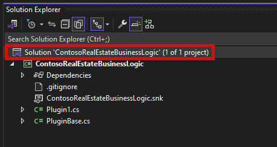

1. Save the solution in the folder `c:\workshop`

1. In a similar way to the TypeScript, we want to use Early Bound Types to avoid mistakes when referencing tables and attributes. To do this, inside **VS Code**, run the following at the PowerShell terminal:

    ```
    pac modelbuilder build --outdirectory "C:\workshop\ContosoRealEstateBusinessLogic\model" --suppressINotifyPattern --namespace "ContosoRealEstate.BusinessLogic.Models" --emitFieldsClasses true --entityNamesFilter "contoso_listing;contoso_reservation"
    ```

    

1. Back in **Visual Studio**, right click on the `ContosoRealEstateBusinesLogic` project, and select **Edit Project File**. 

1. At the top of the xml, under the Project element, add the following:

    ```xml
    <Project Sdk="Microsoft.NET.Sdk">  
      <PropertyGroup>
        <LangVersion>10.0</LangVersion>
      </PropertyGroup>
    ```

    This now means we can use the latest features of C# 10.

1. **Save** the file, and select **Reload Projects** if prompted.

1. In the Visual Studio **solution explorer**, right click on the project -> **Add** -> **New Item**

1. Select **Class**, and provide the name `Exceptions.cs`.

1. Enter the following code:

      ```
      using System;
      using System.Collections.Generic;
      using System.Linq;
      using System.Text;
      using System.Threading.Tasks;
      
      namespace ContosoRealEstateBusinessLogic
      {
          public class ListingUnavailableOnDatesException : Exception
          {
              public ListingUnavailableOnDatesException(string message) : base(message)
              {
              }
          }
      }
      
      ```

      

1. In the solution explorer, right click on `Plugin1`, and select Rename. Enter `ReservationOnCreatePreValidation.cs`

1. When prompted **Would you like to perform a rename in this project**, select **Yes**.

1. Open the `ReservationOnCreatePreValidation` class, replace with the following code:

      ```c#
      using ContosoRealEstate.BusinessLogic.Models;
      using Microsoft.Xrm.Sdk;
      using Microsoft.Xrm.Sdk.Extensions;
      using Microsoft.Xrm.Sdk.Query;
      using System;
      using System.Globalization;
      using System.Linq;
      
      namespace ContosoRealEstateBusinessLogic
      {
          /// <summary>
          /// Plugin development guide: https://docs.microsoft.com/powerapps/developer/common-data-service/plug-ins
          /// Best practices and guidance: https://docs.microsoft.com/powerapps/developer/common-data-service/best-practices/business-logic/
          /// </summary>
          public class ReservationOnCreatePreValidation : PluginBase
          {
      
              public ReservationOnCreatePreValidation() : base(typeof(ReservationOnCreatePreValidation))
              {
      
              }
      
              // Entry point for custom business logic execution
              protected override void ExecuteDataversePlugin(ILocalPluginContext localPluginContext)
              {
                  if (localPluginContext == null)
                  {
                      throw new ArgumentNullException(nameof(localPluginContext));
                  }
      
                  var service = localPluginContext.OrgSvcFactory.CreateOrganizationService(null);
                  contoso_Reservation reservation = ((Entity)localPluginContext.PluginExecutionContext.InputParameters["Target"]).ToEntity<contoso_Reservation>();
                  try
                  {
                      // check if the listing is available
                      var query = new QueryExpression()
                      {
                          EntityName = contoso_Reservation.EntityLogicalName,
                          ColumnSet = new ColumnSet(contoso_Reservation.Fields.contoso_ReservationId)
                      };
                       query.Criteria.AddCondition(contoso_Reservation.Fields.contoso_Listing, ConditionOperator.Equal, reservation.contoso_Listing.Id);
                      query.Criteria.AddCondition(contoso_Reservation.Fields.contoso_ReservationStatus, ConditionOperator.NotEqual, (int)contoso_reservationstatus.Cancelled);
                      query.Criteria.AddCondition(contoso_Reservation.Fields.contoso_From, ConditionOperator.LessThan, reservation.contoso_To.Value);
                      query.Criteria.AddCondition(contoso_Reservation.Fields.contoso_To, ConditionOperator.GreaterThan, reservation.contoso_From.Value);
      
                      var reservations = service.RetrieveMultiple(query);
                      var isListingAvailable = reservations.Entities.FirstOrDefault() == null;
      
                      if (!isListingAvailable)
                      {
                          throw new ListingUnavailableOnDatesException("The listing is not available for these dates.");
                      }
                      localPluginContext.Trace("Listing is available");
      
                      // Validate that the To is after the from date
                      if (reservation.contoso_To < reservation.contoso_From)
                      {
                          throw new InvalidPluginExecutionException("The To date must be after the From date.");
                      }
      
                      localPluginContext.Trace("Reservation dates are valid");
      
                      // Set the name if not already set
                      contoso_listing listing = service.Retrieve(
                          contoso_listing.EntityLogicalName,
                          reservation.contoso_Listing.Id,
                          new ColumnSet(contoso_listing.Fields.contoso_name))
                          .ToEntity<contoso_listing>();
      
                      if (string.IsNullOrEmpty(reservation.contoso_Name))
                      {
                          localPluginContext.Trace("Setting Name");
                          reservation.contoso_Name = $"{listing.contoso_name} - {reservation.contoso_From} - {reservation.contoso_To}";
                      }
                  }
                  catch (Exception ex) 
                  {
                      throw new InvalidPluginExecutionException(ex.Message, ex);
                  }
              }
          }
      }
      
      ```

1. Using `Ctrl-Shift-B` will build your plugin project and output an assembly to `C:\workshop\ContosoRealEstateBusinessLogic\bin\Debug\net462\publish\ContosoRealEstateBusinessLogic.dll`

##  ✅Task 2 : Unit Test Plugin

1. Right click on the Solution in **Solution Explorer**, **Add** -> **New Project** -> Search for **Unit Test Project (.NET Framework)**    
   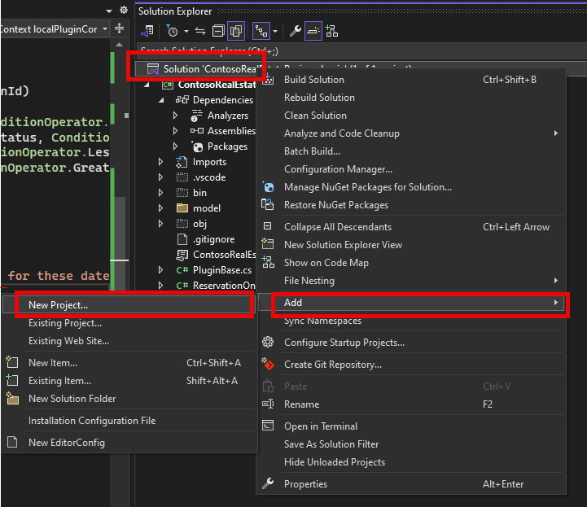

1. Select C# in the Language Drop down.
   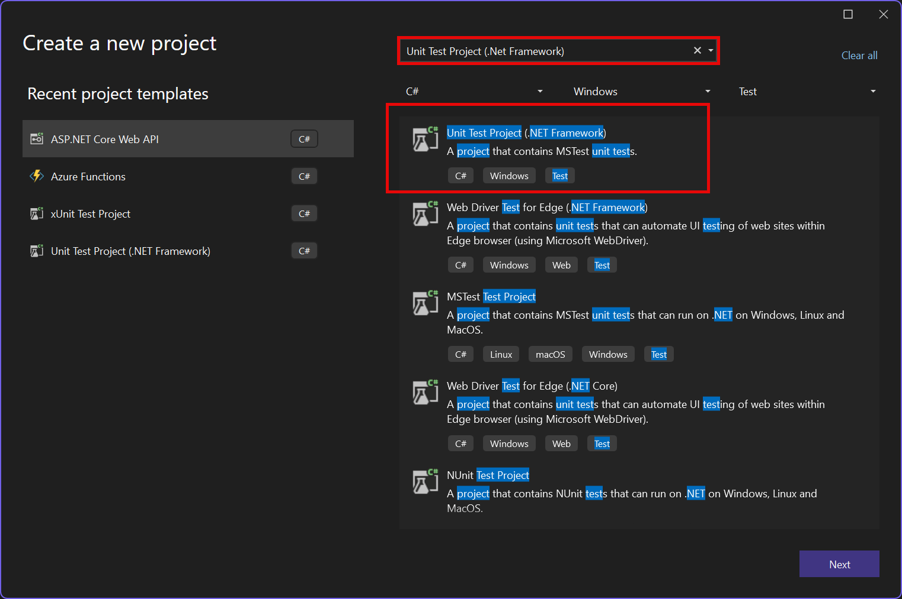

1. Select **Unit Test Project (.NET Framework)** -> **Next**.

1. Set the properties:

   1. Project name: `ContosoRealEstateBusinessLogic.Tests`
   1. Location: `C:\workshop`
   1. Framework: **. NET Framework 4.6.2**    
      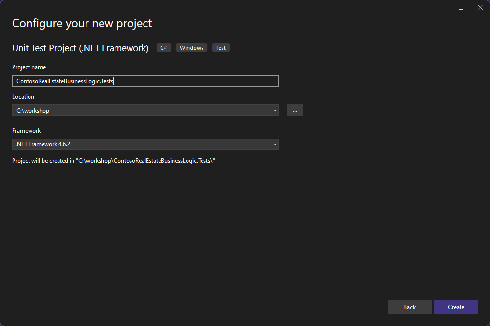

   > [!IMPORTANT]
   >
   > Plugin projects must currently use .NET Framework 4.6.2

1. Select **Create**.

1. Right click on the **References** folder under the new project -> Migrate **packages.json to Package Reference**.

1. Select **Tools** -> **NuGet Package Manager** -> **Manage NuGet Packages for Solution**.

1. Inside the **Browse** tab, Search for `Moq`. 

1. Select `Moq`, and then select the `ContosoRealEstateBusinessLogic.Tests` project

1. Select **Install**.    
   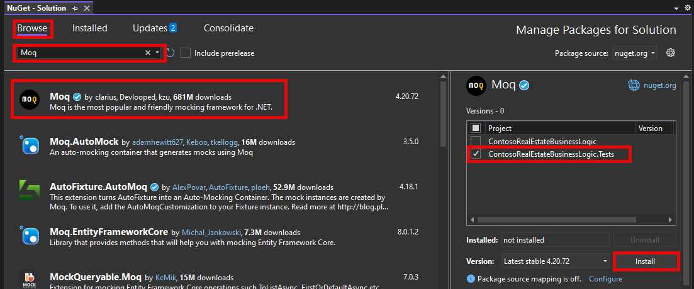

1. In the popup dialog, select **Apply**.

1. **Clear** the search string.

1. Select the **Installed** Tab, and select `Microsoft.CrmSdk.CoreAssemblies`, Select the **Test project** -> **Install** -> **Apply** -> **I Accept**.    
     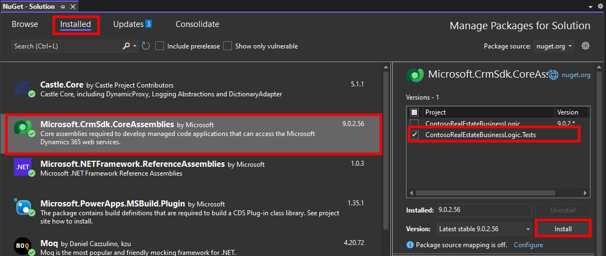

1. Right click on the `ContosoRealEstateBusinessLogic.Tests` project in **solution explorer**, select **References-> Add Reference**, and select `ContosoRealEstateBusinessLogic` and select **OK**.   
     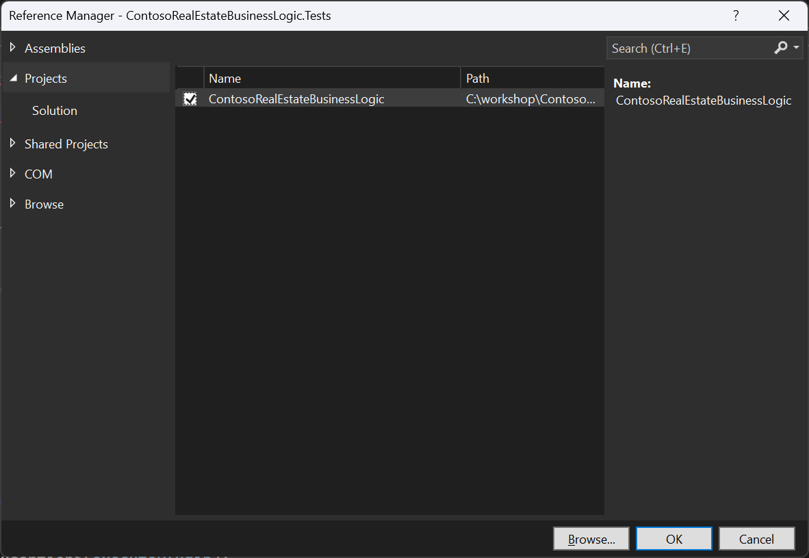

1. Right click on `UnitTest1.cs` and rename to `ReservationCreateUnitTests.cs`. As before, when prompted **Would you like to perform a rename in this project**, select **Yes**.

1. Replace the class with the following:

      ```c#
      using ContosoRealEstate.BusinessLogic.Models;
      using Microsoft.VisualStudio.TestTools.UnitTesting;
      using Microsoft.Xrm.Sdk;
      using Microsoft.Xrm.Sdk.Query;
      using Moq;
      using System;
      using System.ComponentModel.Design;
      
      namespace ContosoRealEstateBusinessLogic.Tests
      {
          [TestClass]
          public class ReservationCreateUnitTests : ReservationOnCreatePreValidation
          {
      
              [TestMethod]
              public void ExecuteDataversePlugin_ShouldThrowException_WhenAlreadyReserved()
              {
                  // Arrange           
                  var target = new Entity(contoso_Reservation.EntityLogicalName)
                  {
                      Id = Guid.NewGuid()
                  };
      
                  target[contoso_Reservation.Fields.contoso_From] = DateTime.Now;
                  target[contoso_Reservation.Fields.contoso_To] = DateTime.Now.AddDays(1);
                  target[contoso_Reservation.Fields.contoso_Listing] = new EntityReference(contoso_listing.EntityLogicalName, Guid.NewGuid());
      
                  // Mock the OrganizationService
                  var mockOrganizationService = new Mock<IOrganizationService>();
                  var mockOrganizationServiceFactory = new Mock<IOrganizationServiceFactory>();
                  mockOrganizationServiceFactory.Setup(x => x.CreateOrganizationService(It.IsAny<Guid?>())).Returns(mockOrganizationService.Object);
      
                  // Mock the tracing service
                  var mockTraceService = new Mock<ITracingService>().Object;
      
                  // Mock the Execution Context
                  var mockLocalPluginContext = new Mock<ILocalPluginContext>();
                  var mockPluginExecutionContext = new Mock<IPluginExecutionContext>();
                  mockLocalPluginContext.Setup(context => context.PluginExecutionContext)
                          .Returns(mockPluginExecutionContext.Object);
      
                  mockLocalPluginContext.Setup(context => context.PluginExecutionContext.OutputParameters)
                      .Returns(new ParameterCollection());
                  mockLocalPluginContext.Setup(context => context.PluginExecutionContext.InputParameters)
                      .Returns(new ParameterCollection());
      
                  mockLocalPluginContext.Setup(context => context.PluginExecutionContext.MessageName).Returns("Create");
                  mockLocalPluginContext.Setup(context => context.PluginExecutionContext.Stage).Returns(10); // PreValidation
                  mockLocalPluginContext.Setup(context => context.PluginExecutionContext.InputParameters).Returns(new ParameterCollection());
                  mockLocalPluginContext.Setup(context => context.TracingService).Returns(mockTraceService);
                  mockLocalPluginContext.Setup(context => context.OrgSvcFactory).Returns(mockOrganizationServiceFactory.Object);
      
                  var inputParameters = mockLocalPluginContext.Object.PluginExecutionContext.InputParameters;
                  inputParameters["Target"] = target;
      
                  mockOrganizationService.Setup(x => x.RetrieveMultiple(It.IsAny<QueryExpression>()))
                     .Returns(
                          // Simulate a match to the query
                          new EntityCollection(new contoso_Reservation[] { new contoso_Reservation() })
                     );
      
                  mockOrganizationService.Setup(x=> x.Retrieve(It.IsAny<string>(), It.IsAny<Guid>(), It.IsAny<ColumnSet>()))
                      .Returns(new contoso_listing { contoso_name = "Listing Name"});
      
                  // Act
                  void executePlugin() => new ReservationCreateUnitTests().ExecuteDataversePlugin(mockLocalPluginContext.Object);
      
                  // Assert
                  var expectedException = Assert.ThrowsException<InvalidPluginExecutionException>(executePlugin);
                  Assert.IsInstanceOfType(expectedException.InnerException, typeof(ListingUnavailableOnDatesException));
              }
          }
      }
      
      ```

      

1. Open the test explorer **Test** -> **Test Explorer**.

1. Press the **Green** **Run All Test button** to run all the tests.

1. Experiment with debugging and stepping through the code.

## ✅ Task 3 : Deploy and Register Plugin

We can now deploy our plugin into Dataverse and test it

1. Open the **Plugin Registration Tool** by running the following command back in the VS Code PowerShell terminal:
   ```powershell
   pac tool prt
   ```

   The Plugin Registration Tool will download and launch.

2. Select **CREATE NEW CONNECTION**.

3. Check **Display list of available organizations**.

4. Enter your **User Name** and **Password**.

5. Select **Login**.

6. After logging in, **select** your developer environment -> **Login**.

7. Select **Register** -> **Register New Assembly** -> **Select** `C:\workshop\ContosoRealEstateBusinessLogic\bin\Debug\net462\ContosoRealEstateBusinessLogic.dll`

8. Select **Register Selected Plugins**    
   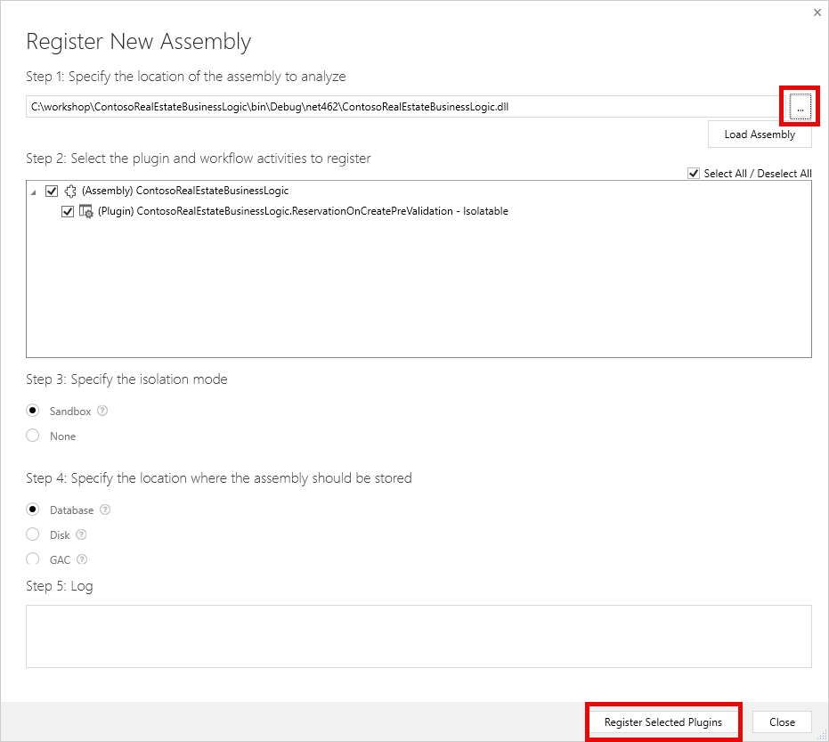

9. Select the assembly `ContosoRealEstateBusinessLogic`.

10. Select **Register** -> **Register Step**.

11. Enter the following

    1. Message: `Create`
    2. Primary Entity: `contoso_reservation`

12. Select **Register New Step**.    
    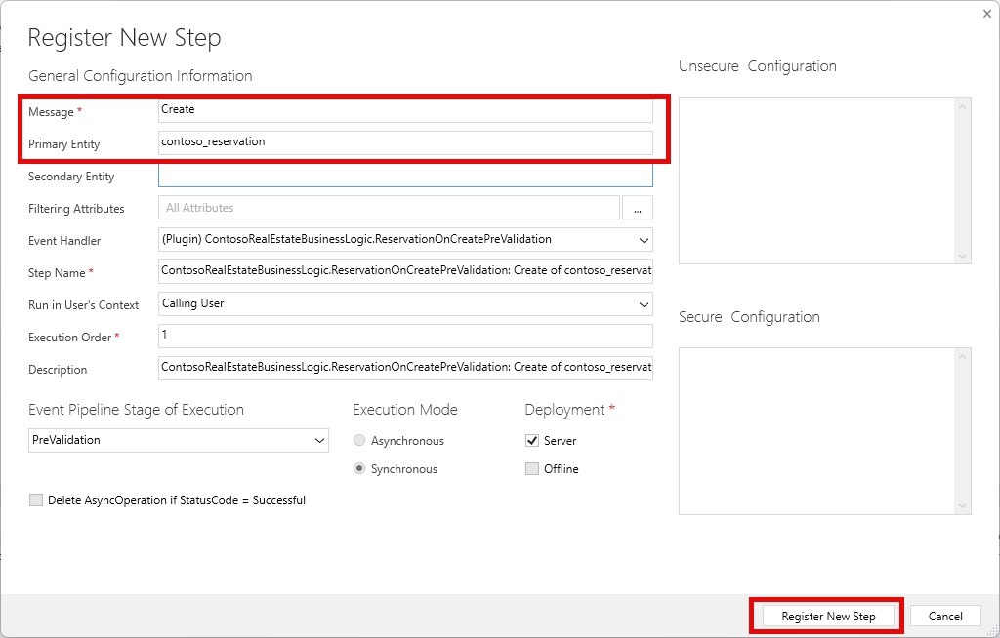

13. Inside **make.powerapps.com**, open the workshop solution, and select **Add existing** -> **More** -> **Developer** -> **Plugin-in step**

14. Search for **Contoso** and select the `ContosoRealEstateBusinessLogic` plugin step -> **Add**.    
    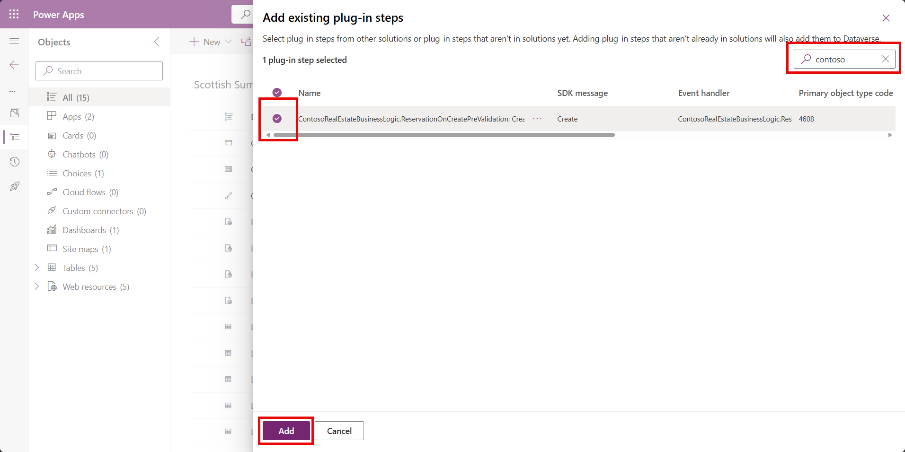

15. Select Plug-in steps, and against the Plugin step that you added, select the **... more menu** -> **Advanced** -> **Add required objects** -> **OK**. This will add the Plugin assembly related to the step.    
    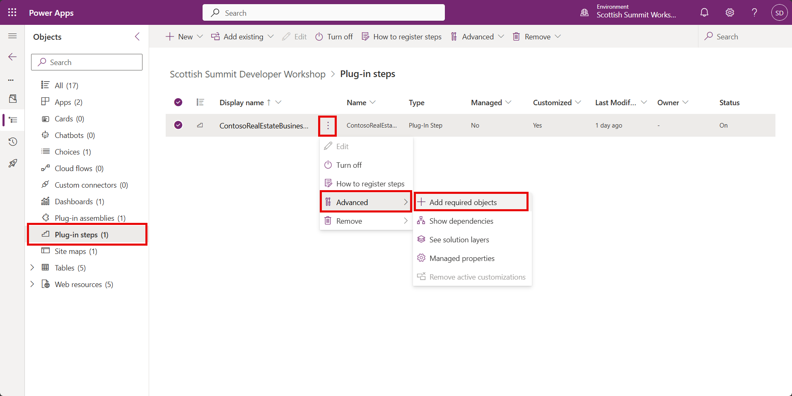

    

## ✅ Task 4 : Test your plugin

1. Inside **make.powerapps.com**, navigate to **Apps** -> **Contoso Real Estate Administration** (Model Driven App) -> **Play**

1. Open an existing **sample Listing** (e.g. Beach House)

1. Select the **Reservations** tab.

1. Select **+New Listing Reservation**.    
   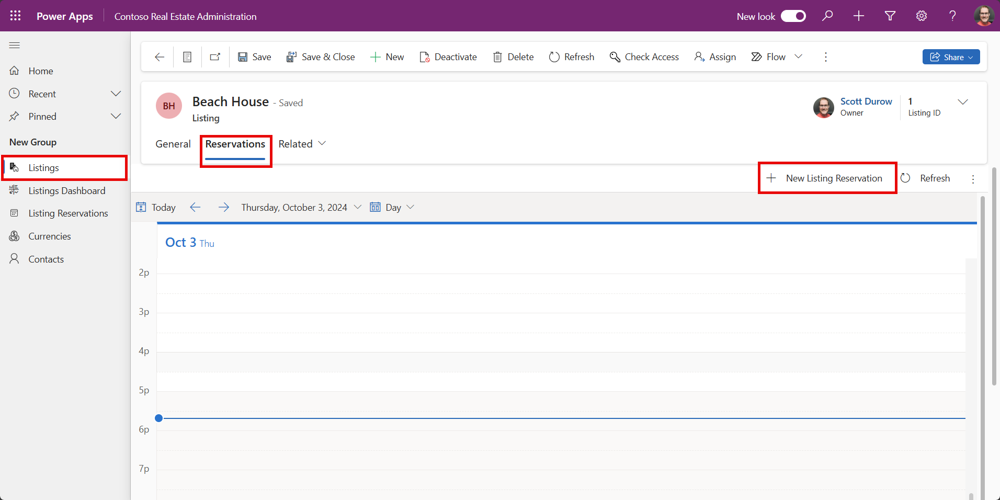

1. Enter the the following data:

   1. Customer: Create a new customer record
   1. Guests: **1**
   1. From: **16th Jan 2025**
   1. To: 1st Jan 2025 (This should cause an validation error because it is before the From date)

1. Select **Save**.

1. You should see an Business Process Error by the plugin:    
   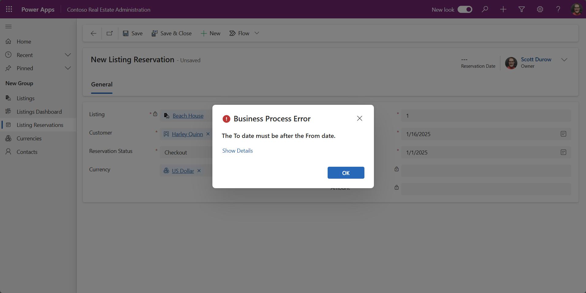

1. Correct the **To Date** so that it is after the From Date, and Select **Save** again.

1. You will see the name auto populated by the plugin.

1. Select **Save & Close** -> **+ New Listing Reservation**. Enter:

   1. From: 17th Jan 2025
   1. To: 18th Jan 2025

1. Select **Save**. You should see the plugin error raised "The listing is not available for these dates".    
   

1. You can try and edit the code and update the plugin. Remember to select the steps that you previously created when updating.    
   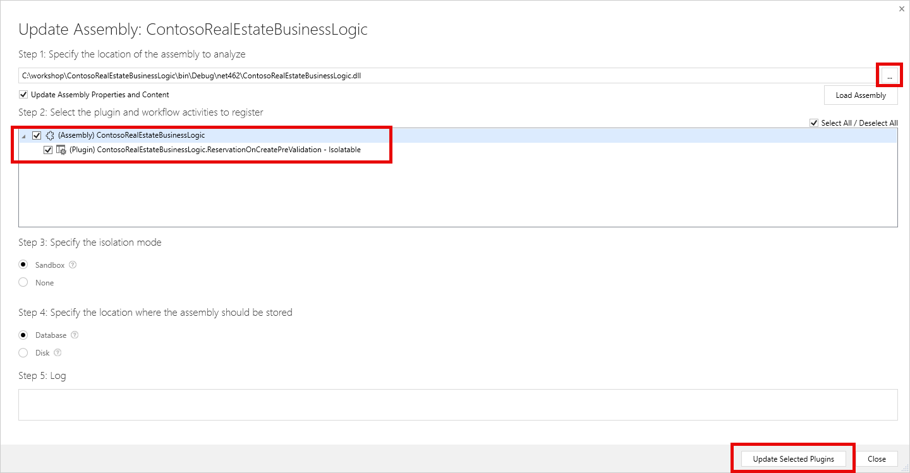

   

   ## 🥳Congratulations!

   Now that you have completed this lab you have learned how to extend Dataverse using custom C# Plugins. 

